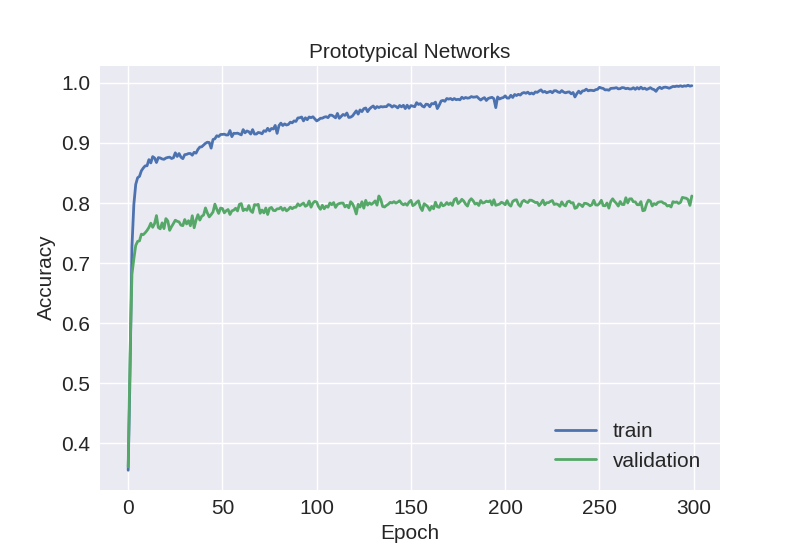
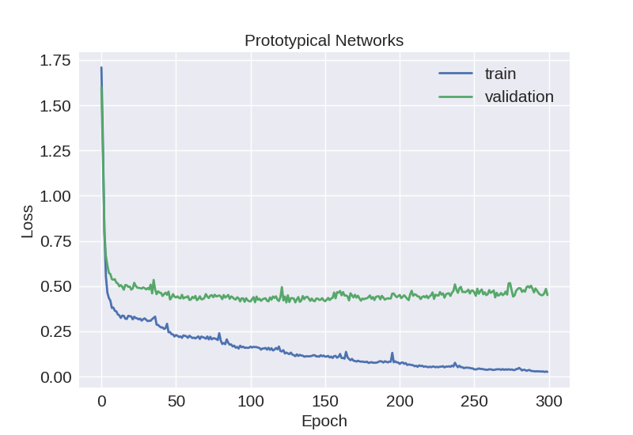

## Few-shot learning for bearing fault diagnosis pytorch

## :book: 1. Introduction
A public repository branch of **deep transfer learning fault diagnosis**, including popular few-shot learning algorithms implemented for bearing fault diagnosis problems. For domain adaptation based methods, see the GitHub repository: [fault-diagnosis-transfer-learning-pytorch](https://github.com/Xiaohan-Chen/fault-diagnosis-transfer-learning-pytorch)

For further introductions to transfer learning and few-shot learning in bearing fault diagnosis, please read our [paper](https://ieeexplore.ieee.org/document/10042467). And if you find this repository useful and use it in your works, please cite our paper, thank you~:
```
@ARTICLE{10042467,
  author={Chen, Xiaohan and Yang, Rui and Xue, Yihao and Huang, Mengjie and Ferrero, Roberto and Wang, Zidong},
  journal={IEEE Transactions on Instrumentation and Measurement}, 
  title={Deep Transfer Learning for Bearing Fault Diagnosis: A Systematic Review Since 2016}, 
  year={2023},
  volume={72},
  number={},
  pages={1-21},
  doi={10.1109/TIM.2023.3244237}}
```

## :clipboard: 2. To Do
- [x] [Siamese Networks (ICML 2015)](https://www.cs.cmu.edu/~rsalakhu/papers/oneshot1.pdf)
- [x] [Prototypical Networks (NeurIPS 2017)](https://arxiv.org/abs/1703.05175)
- [ ] Matching Networks
- [ ] Relation Networks

## :package: 3. Requirements
- Python 3.9.12
- Numpy 1.23.1
- torchvision 0.13.0
- Pytorch 1.12.0
- tqdm 4.46.0

## :pouch: 4. Dataset
- CWRU

Data structure please refer to [fault-diagnosis-transfer-learning-pytorch](https://github.com/Xiaohan-Chen/fault-diagnosis-transfer-learning-pytorch)

## :tv: 5. Usage
- Siamese Networks 10-way 1-shot experiment
```bash
python3 Siamese.py --support 300 --backbone "CNN1D" --s_load 3 --t_load 2
```


- Prototypical Networks 10-way 10-shot experiment

```bash
python3 Prototypical.py --n_train 800 --s_load 3 --t_load 2 --support 10 --query 10
```

## :flashlight: 6. Results



## :camping: 7. See also
[GitHub: fault-diagnosis-transfer-learning-pytorch](https://github.com/Xiaohan-Chen/fault-diagnosis-transfer-learning-pytorch)